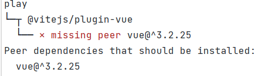

# 错误收集
## 安装 @vitejs/plugin-vue 有警告
### 起因:
在 `play 文件夹`下面安装 `vite` 和 `@vitejs/plugin-vue` 的时候，提示
```javascript
WARN Issues with peer dependencies found
play
└─┬ @vitejs/plugin-vue
  └── ✕ missing peer vue@^3.2.25
Peer dependencies that should be installed:
  vue@^3.2.25
```
### 截图记录:


### 问题原因:
在 `npm 3` 中，不会再强制安装 `peerDependencies` （对等依赖）中所指定的包，而是通过警告的方式来提示我们。`pnpm` 会在全局缓存已经下载过的依赖包，如果全局缓存的依赖版本与项目 `package.json` 中指定的版本不一致，就会出现这种 hint 警告。
### pnpm 团队成员给出的解答:
> There are two types of peer deps: optional peer dependencies and non-optional ones. The warnings are only printed for non-optional peer dependencies. If a package works without the peer dependencies, then it should be declared as optional peer dependency. Optional peer dependencies are supported by npm/yarn/pnpm for a long time.

### 解决方案:
1.在项目的 `package.json` 中配置 `peerDependencyRules` 忽略对应的警告提示:
```javascript
{
  "pnpm": {
    "peerDependencyRules": {
      "ignoreMissing": [
        "react"
      ]
    }
  }
}
// 我试了一下，没什么屁用
```
2.在 `.npmrc` 配置文件中添加 `strict-peer-dependencies=false` ，这意味着将关闭严格的对等依赖模式。操作命令如下:
```javascript
npm config set strict-peer-dependencies=false
// 我没试过，我觉得这么做有点离谱
```
3.我的解决方案:
我直接在 `play 文件夹`下面 直接安装了 `vue@3.2.25`，然后我又重新走了一下那个安装命令，警告信息没有了。
